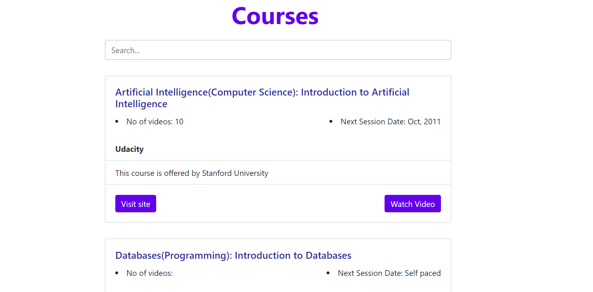
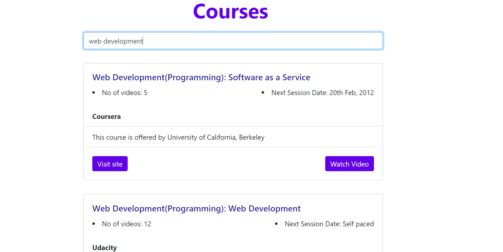
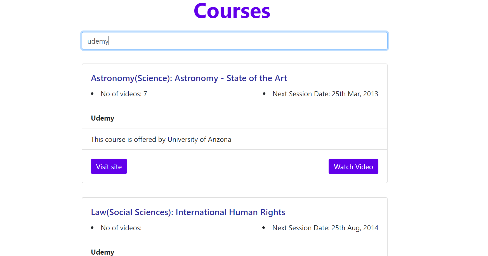

# Course-search App
This is a course-search application where users can search various subjects based on sujects and providers available in the app.

## Authors:
Jashwanthi V

## Technology used
React, Jsx.

## Objective
Create a couse search application.

## Guidelines
1. when you open the app, you can see text box.
2. you can search either by subject name or provider which you are interested.

# Images

1. This is the home page of this application.

2. This is the result after searching one of the child subject name.

3. This is the result after search one of the provider name.

